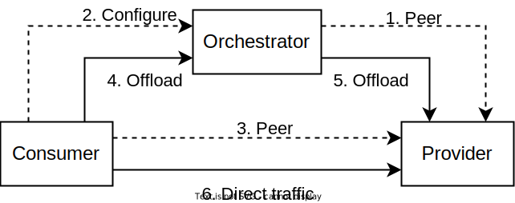
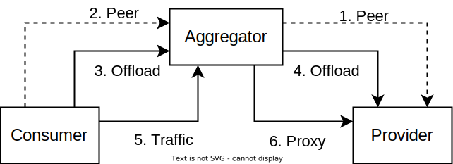

# liqo-broker

A pluggable resource broker for [Liqo](https://github.com/liqotech/liqo/).

Liqo-broker offers added-value services to a federation targeting different scenarios:

 - **catalog**: the middleman enables the discovery of the resources available on the federation. The customer can then query the catalog and discover the features and IP addresses of the providers, which he can use to open direct peering sessions towards them.
 - **orchestrator**: the customer peers with the middleman, who is in charge of offloading workloads on a series of providers; the customer maintains a direct data plane towards the providers. The choice of providers can be made directly by the customer, or indirectly by specifying criteria based on KPIs (eg. minimum uptime). The added value is in having the visibility over provider metrics to optimize scheduling.
 > Note: at the moment criteria-based selection is not implemented.
 - **aggregator**: the customer peers with the middleman, who is now "opaque": it offloads workloads on a series of providers, but the customer has no visibility into the offloading process. The data plane is also going through the aggregator. The added value is in presenting the resources of many providers in an aggregated fashion.

> **Warning**: the orchestrator and the aggregator rely on unsupported modifications to Liqo, and as such they should be considered early proofs-of-concept!

> This project was developed for Liqo v0.4.1; later versions may not be supported.

## Catalog


The dashed-arrow step (#1) describes the setup phase; the solid-arrow steps (#2 to #4) describe the use phase.

### Installation: provider

The provider just needs to [install Liqo](https://doc.liqo.io/installation/install/):


```sh
liqoctl install k3s --name=provider # Select a Kubernetes distribution as needed
```

To advertise on the catalog, the provider must open a peering towards the catalog cluster, or accept a peering from it:

```sh
# Run "liqoctl generate-add-command" on the broker to get the below command, copy it, and paste it on the provider machine
liqoctl add --auth-url URL --id ID --token TOKEN
```

### Installation: middleman

The middleman also needs to install Liqo, and then run the broker with the `--with-catalog` flag.

Edit the file `k8s/pod.yml` to select the command line flags you don't need (eg. `--with-aggregator`), then run the pod:

```sh
kubectl apply -f k8s/pod.yml
```

The HTTP API will be exposed on port 8000 on the pod; create a `Service` and expose it as needed. The repository contains an example service you can use:

```sh
kubectl apply -f k8s/http-svc.yml
```

### Installation: consumer

The consumer needs to install Liqo alongside a client application (eg. a dashboard) that can interact with the catalog API documented below. Please refer to the installation guide for your client application; no further setup is required for Liqo.

### Usage

The catalog exposes an HTTP API that describes the clusters it knows (i.e. those that are peered with the catalog, in the current implementation).

It has a single endpoint, `/api/clusters`, that takes no parameters and returns the list of foreign clusters as Kubernetes JSON. Here's an example (abridged for brevity):

```
$ curl http://127.0.0.1:8000/api/clusters

[
  {
    "kind": "ForeignCluster",
    "apiVersion": "discovery.liqo.io/v1alpha1",
    "metadata": {
      "name": "polito-labs-79eba8",
      "labels": {
        "discovery.liqo.io/cluster-id": "32f0b45b-5c06-4cc4-84b6-03a323ffc93d",
        "discovery.liqo.io/discovery-type": "LAN"
      }
    },
    "spec": {
      "clusterIdentity": {
        "clusterID": "32f0b45b-5c06-4cc4-84b6-03a323ffc93d",
        "clusterName": "polito-labs"
      },
      "outgoingPeeringEnabled": "Auto",
      "incomingPeeringEnabled": "Auto",
      "networkingEnabled": "Yes",
      "foreignAuthUrl": "https://194.116.77.112:31520",
      "insecureSkipTLSVerify": false,
      "ttl": 90
    }
  },
  ...
]
```

This API is meant to be consumed by a client application that can display this information in a user-friendly manner, and optionally allow the user to peer with the cluster.

## Orchestrator



The dashed-arrow steps (#1 to #3) describe the setup phase; the solid-arrow steps (#4 to #6) describe the use phase.

### Installation: provider

The provider just needs to [install Liqo](https://doc.liqo.io/installation/install/):


```sh
liqoctl install k3s --name=provider # Select a Kubernetes distribution as needed
```

Then, it must peer with the broker (assuming it has already installed Liqo):

```sh
# Run "liqoctl generate-add-command" on the broker to get the below command, copy it, and paste it on the provider machine
liqoctl add --auth-url URL --id ID --token TOKEN
```

### Installation: middleman

The middleman needs to install Liqo, which must be patched manually to use a [different virtual kubelet](https://github.com/CapacitorSet/liqo-orchestrator-vk) that supports orchestrator networking.

Once Liqo is installed, edit the `liqo-controller-manager` deployment:

```sh
kubectl edit deployment -n liqo liqo-controller-manager
```

Search for a command-line flag called `kubelet-image`, and set it to `capacitorset/liqo-broker-vk:latest`.

Once you patched the controller manager, peer with any providers you want to support:

```sh
# Run "liqoctl generate-add-command" on the provider to get the below command, copy it, and paste it on the broker machine
liqoctl add --auth-url URL --id ID --token TOKEN
```

Finally, run the broker with the `--with-orchestrator` flag. Edit the file `k8s/pod.yml` to select the command line flags you don't need (eg. `--with-aggregator`), then run the pod:

```sh
kubectl apply -f k8s/pod.yml
```

The HTTP API will be exposed on port 8000 on the pod; create a `Service` and expose it as needed. The repository contains an example service you can use:

```sh
kubectl apply -f k8s/http-svc.yml
```

### Installation: consumer

Likewise, the consumer needs to install Liqo and patch the `liqo-controller-manager` deployment. Then, it must peer with *both* the broker and any provider that it will use through the orchestrator.

In a future development, the orchestrator will expose an API to direct the consumer cluster to peer only with the providers that are effectively in use; in this early proof of concept you have to peer manually.

The consumer also needs to install a client of their choice (eg. a Web dashboard) to consume the orchestrator API. Please refer to the installation guide of your client for further instructions.

### Usage

Much like the catalog, the orchestrator exposes an HTTP API. It has two endpoints: `/api/clusters` presents a list of providers for orchestration, and `/api/toggle` enables or disables orchestration on a provider. Again, this API is meant

`/api/clusters` takes no parameters, while `/api/toggle` takes the URL parameters `id` with the cluster ID and `enable` that can be `true` or `false`. For example, to enable the cluster `fb51002c-7f1b-4327-898b-a8a5aa0f6f95` you would use `/api/toggle?id=fb51002c-7f1b-4327-898b-a8a5aa0f6f95&enable=true`.

This API is meant to be consumed by a client application that presents the list of clusters in a user-friendly way, and allows the consumer to select the clusters they would like.

Once the consumer has selected some providers of their choice, they can offload applications on the broker as if it were a standard Liqo cluster (eg. using the provided NamespaceOffloading `k8s/nsoffloading.yml` in a namespace they wish to offload). The orchestrator will then re-offload the pods to the selected providers.

Note that the data plane is direct: when the consumer generates traffic towards an offloaded pod, the traffic will be routed directly to the provider, without going through the orchestrator cluster.

## Aggregator



The dashed-arrow steps (#1 to #2) describe the setup phase; the solid-arrow steps (#3 to #6) describe the use phase.

(The documentation for the aggregator is work-in-progress.)

<!-- ## Installation

### Requirements

### On the broker's cluster

 - Create a pod with this broker (use image `capacitorset/liqo-broker`), and create a service pointing to it.
 
 - Suppose the service is called `broker-svc` in the `broker` namespace, then the address would be `broker-svc.broker.svc.cluster.local`. Edit the `liqo-controller-manager` deployment to add the following flag: `--external-monitor=broker-svc.broker.svc.cluster.local:7000`.

 - Create a NamespaceOffloading in the `liqo` namespace with `podOffloadingStrategy: Local`, so that the `liqo-network-manager` service is reflected on the customer's cluster:
    
    ```yaml
    apiVersion: offloading.liqo.io/v1alpha1
    kind: NamespaceOffloading
    metadata:
        name: offloading
        namespace: liqo
    spec:
        namespaceMappingStrategy: DefaultName
        podOffloadingStrategy: Local
        clusterSelector:
            nodeSelectorTerms:
            - matchExpressions:
            - key: liqo.io/type
                operator: In
                values:
                - virtual-node
    ```

 - Create an outgoing peering with the customer. This is required to reflect the `liqo-network-manager` service.

### On the customer's cluster

 - Take note of the address of the service you reflected in the previous steps on the cluster. For example, if `kubectl get svc -A` shows that the service is called `liqo-network-manager` and belongs to the namespace `liqo-broker-b9d3d5`, then the address would be `liqo-network-manager.liqo-broker-b9d3d5.svc.cluster.local`.

 - Edit the `liqo-controller-manager` deployment to add the following command line flags:


```
--kubelet-extra-args=--remote-ipam=server=<the address you just found>:6000
--kubelet-image=capacitorset/liqo-broker-vk:latest
```

[Spiegare perchè vengono fatte varie modifiche, specie perchè modifico i deployment]

## Usage

Simply create Liqo peerings as needed: the broker cluster will present a ResourceOffer that is the sum of all ResourceOffers from clusters with which it has outgoing peerings (the "provider" clusters). It will also react to workloads that are offloaded to the broker cluster by offloading them in turn to the provider clusters using a NamespaceOffloading. -->

## Credits

Based on a prototype by [Giuseppe Alicino](https://github.com/giuse2596).
